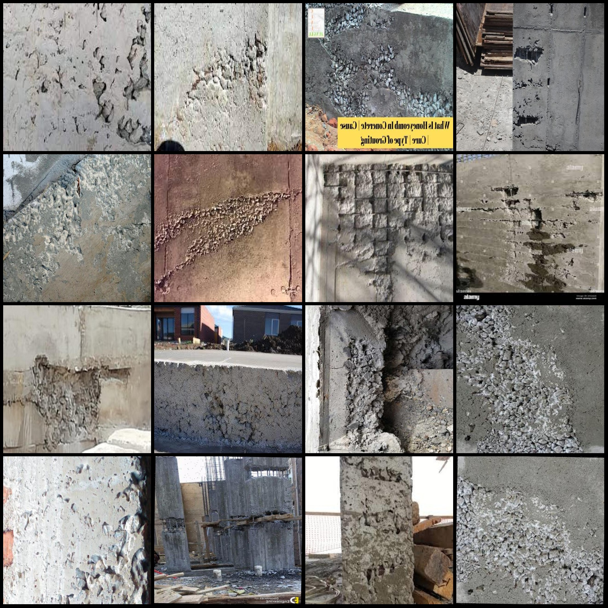
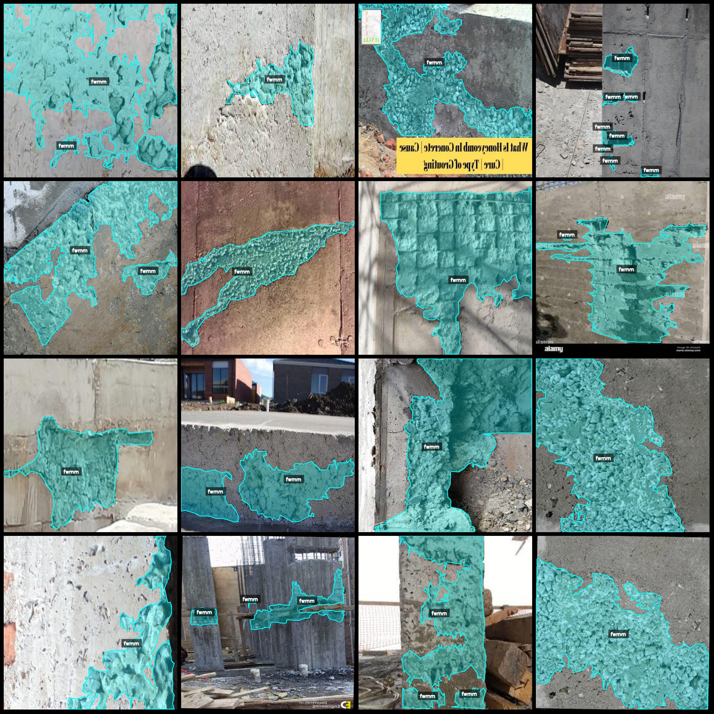
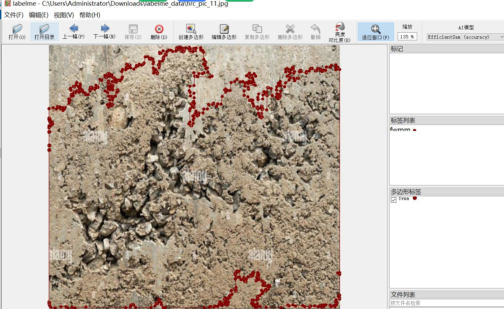

# Intelligent Building Defects Concrete Cell Holes and Surface Roughness Identification and Segmentation Dataset in labelme Format: 915 Images, 1 Category

Dataset format: labelme format (without mask files, only including jpg images and corresponding json files)
Number of image files: 915
Number of annotations: 915
Number of annotation categories: 1
Annotation category name: "fwmm"
Box count for each category: 2101
Total boxes: 2101
Annotation tool used: labelme = 5.5.0
Image resolution: 640x640
Annotation rules: Polygon box is drawn around the category
Important note: The dataset can be edited using labelme, but the json dataset needs to be converted into either mask or yolo or coco format for semantic segmentation or instance segmentation
Special declaration: This dataset does not guarantee the accuracy of the trained model or weight files
Image preview:
Annotation example:
Randomly selected 16 images:
Annotation drawing result:
Labelme editing image example:

## Images

Here is a pay link on Stripe ( https://buy.stripe.com/3cs8yP7sY87d0vu9AB ). Please contact me lonlonago@foxmail.com after funding $89, and I will send you a complete data files , thank you!

